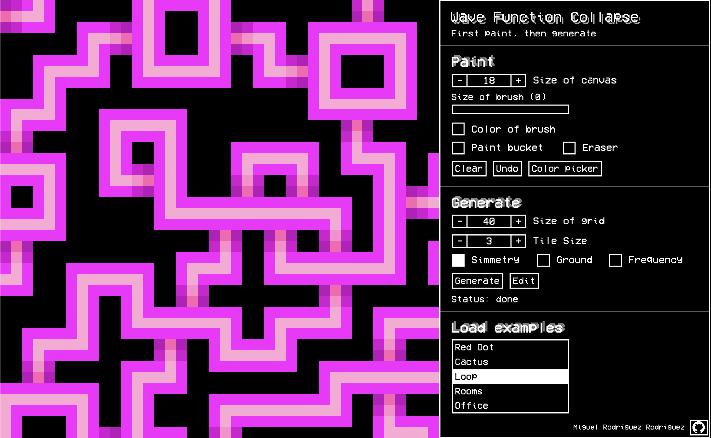
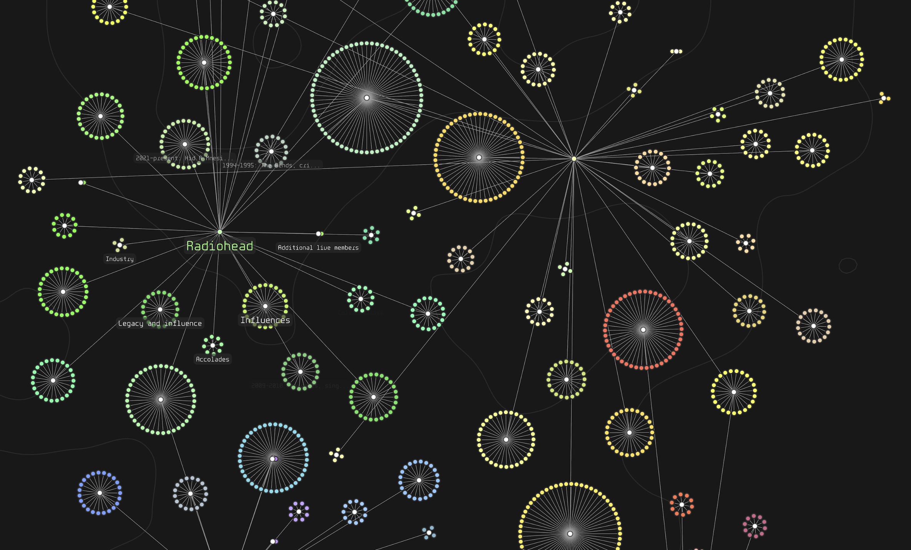

# My p5.js Projects

This [repository](https://miguelrr11.github.io) features all my projects built with **p5.js**, showcasing algorithms, physics simulations, artificial intelligence, games and more.

## Featured Projects

### [Digital Logic Sim](https://miguelrr11.github.io/Algorithms/Logic_Sim_v3/)
Digital Logic Simulator inspired by [Sebastian Lague](https://www.youtube.com/@SebastianLague).

---

### [NEAT Pendulums](https://miguelrr11.github.io/IAs/Smart_Pendulums_V2/)
[NEAT](https://nn.cs.utexas.edu/downloads/papers/stanley.ec02.pdf) algorithm learns to balance an inverted pendulum.

---

### [Wave Function Collapse Painter](https://miguelrr11.github.io/Algorithms/Wave_Function_Collapse_Painter/)
Demonstration of the WFC (overlapping method) with user-created tiles, inspired by the [original github page](https://github.com/mxgmn/WaveFunctionCollapse).

---

### [Music Visualizer](https://miguelrr11.github.io/Algorithms/Music_Visualizer/)
Real-time music visualization using frequency data to generate graphics.

---

### [WikiGraph](https://miguelrr11.github.io/Algorithms/WebViewer/)
Interactive Wikipedia article explorer.

---