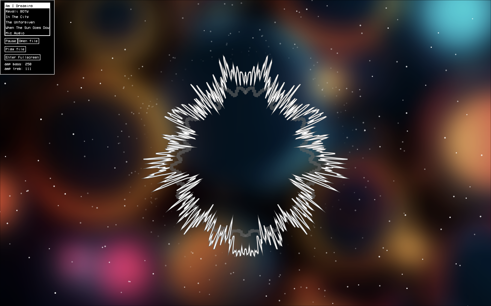
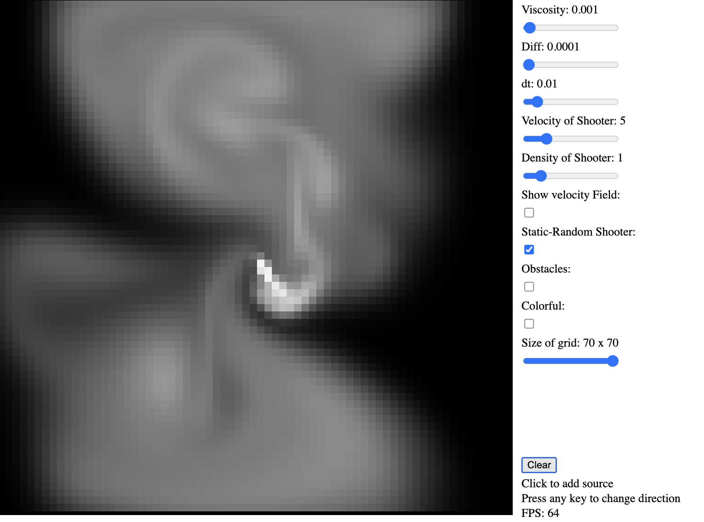
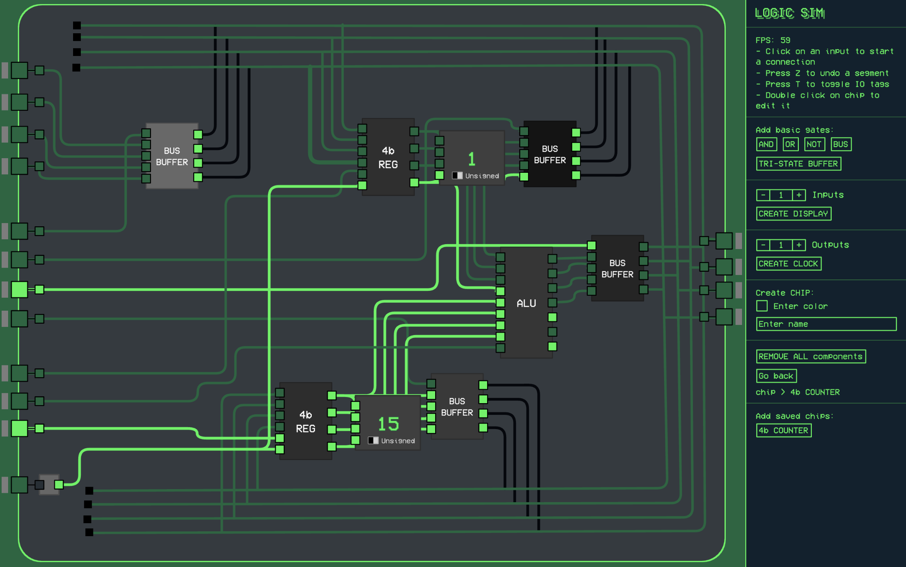
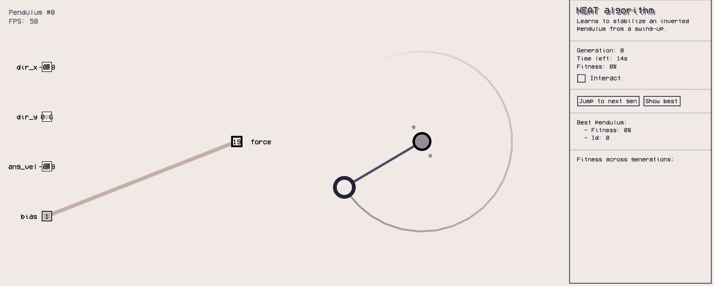

# My p5.js Projects

This repository features interactive projects built with **p5.js**, showcasing algorithms, physics simulations, artificial intelligence, games and more.

## Featured Projects

### [Music Visualizer](Algorithms/Music_Visualizer/)
Real-time music visualization using frequency data to generate graphics.

---

### [RT Fluid Dynamics](Physics_Simulations/RT_Fluid_Dynamics/)
Real-time fluid simulation based on the [famous paper](http://graphics.cs.cmu.edu/nsp/course/15-464/Fall09/papers/StamFluidforGames.pdf).

---

### [Digital Logic Sim](Algorithms/Logic_Sim_v3/)
Digital Logic Simulator inspired by [Sebastian Lague](https://www.youtube.com/@SebastianLague).

---

### [NEAT Pendulums](IAs/Smart_Pendulums_V2/)
[NEAT](https://nn.cs.utexas.edu/downloads/papers/stanley.ec02.pdf) algorithm learns to balance an inverted pendulum.

---