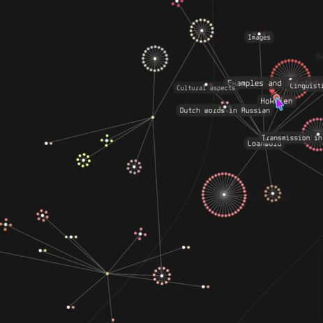

# My p5.js Projects

This [repository](https://miguelrr11.github.io) features all my projects built with **p5.js**, showcasing algorithms, physics simulations, artificial intelligence, games and more.

Currently working on: **[Procedural Road and Intersection Generator](https://miguelrr11.github.io/Algorithms/ProcRoadv2/)**

## Featured Projects

### [Digital Logic Sim](https://miguelrr11.github.io/Algorithms/Logic_Sim_v3/)
Digital Logic Simulator inspired by [Sebastian Lague](https://www.youtube.com/@SebastianLague).

---

### [Road Network Generator](https://miguelrr11.github.io/Algorithms/ProcRoadv2/)
A tool to design road networks with automatic intersections.

---

### [Wave Function Collapse Painter](https://miguelrr11.github.io/Algorithms/Wave_Function_Collapse_Painter/)
Demonstration of the WFC (overlapping method) with user-created tiles, inspired by the [original github page](https://github.com/mxgmn/WaveFunctionCollapse).

---

### [WikiGraph](https://miguelrr11.github.io/Algorithms/WebViewer/)
Interactive Wikipedia article explorer.

---

### [Lake Ecosystem Simulation](https://miguelrr11.github.io/tfg_latex_etsiinf-2023.02.20/)
My Computer Engineering Bachelor’s Thesis, a simuation of micro and macro living organisms based on inner relationships.

---
